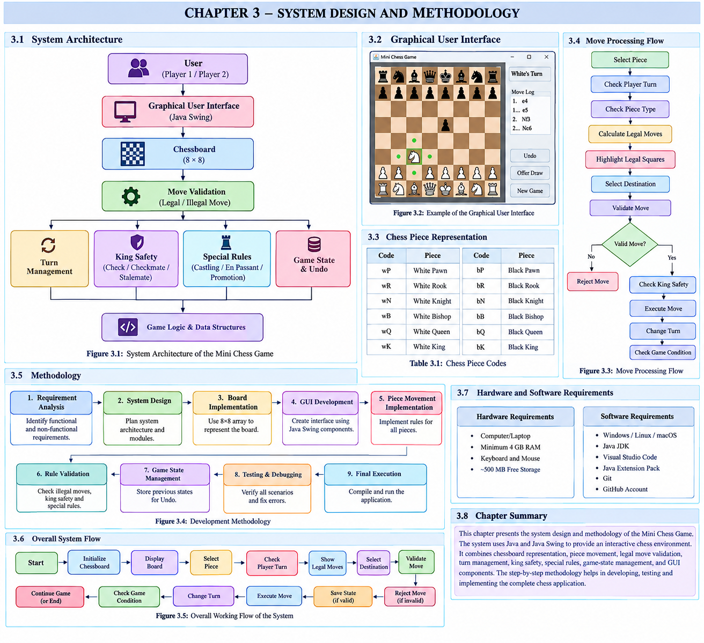

# Java Chess Game ♟️

A desktop chess game built in **Java** using the **Swing** GUI toolkit. Play a two-player game on an interactive 8×8 board with standard chess rules and useful game controls.



## Features

- Interactive 8×8 chessboard with Unicode chess pieces
- Turn-based play for White and Black
- Legal-move validation and highlighted available moves
- Piece capture support
- Castling (king-side and queen-side)
- En passant capture
- Pawn promotion to Queen, Rook, Bishop, or Knight
- Check, checkmate, and stalemate detection
- Move history panel
- Undo last move
- Draw offer option

## Technologies Used

- Java
- Java Swing
- AWT

## Requirements

- Java Development Kit (JDK) 8 or newer

## How to Run

1. Clone this repository:

   ```bash
   git clone https://github.com/YOUR-USERNAME/java-chess-game.git
   ```

2. Open the project folder:

   ```bash
   cd java-chess-game
   ```

3. Compile the source code:

   ```bash
   javac ChessGame.java
   ```

4. Run the game:

   ```bash
   java ChessGame
   ```

## How to Play

1. Click one of your pieces.
2. Valid destination squares are highlighted.
3. Click a highlighted square to move the selected piece.
4. Use **Undo** to reverse the most recent move.
5. Use **Offer Draw** when both players agree to a draw.

## System Design


## Project Structure

```text
java-chess-game/
├── ChessGame.java       # Main application source code
├── chess.png            # Project image asset
├── system design.png    # System design diagram
└── README.md            # Project documentation
```

## Future Improvements

- Add a new-game / restart button
- Add a chess clock
- Save and load games
- Add single-player mode with a computer opponent
- Add sound effects and themes

## Author

Rutuja Thorat

## License

This project is licensed under the [MIT License](LICENSE).
